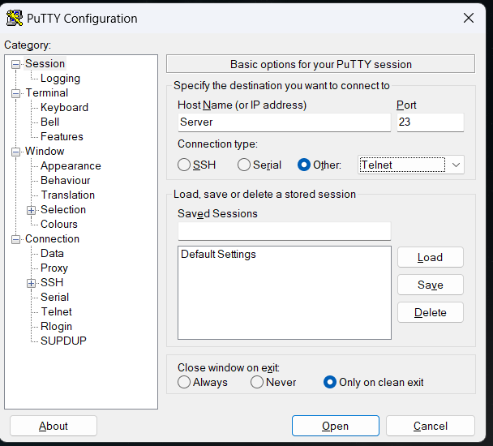

# test2 #
## Test3 ##
### Test4 ###

**Das ist Fett**

*Italic*

> Blockquoote
zweite Zeile

1. Erstens
2. Zweitens
3. Drittens

- Erstens 
- Zweitens
- Drittens

#include <stdio.h>

```
 public void preOrder(Node knoten) {
        if (knoten != null) {
            System.out.print(knoten.getData() + ", ");
            preOrder(knoten.left);
            preOrder(knoten.right);
        }
    }
```

------
[ORF](https://www.orf.at)

